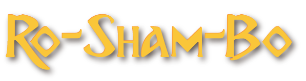

**Ro-Sham-Bo is a Player vs. Computer game expanded off of the schoolyard Rock-Paper-Scissors game. In Ro-Sham-Bo, we follow our friend Choop as he battles three enemies and eventually three more bosses. Play your own Choop adventures at [Choop Link](https://infinite-earth-38608.herokuapp.com/)**

## Open Source Code and Pull Requests
If you want to add to Choop pull requests will be reviewed by a contributing member. Pull request will be reviewed as soon as a contributor can review and contributors are not obligated to approve said requests.  Please follow below to reduce the amount of merge conflicts.

## Getting Started
 After forking or cloning this repo, you will need to run a npm i package.json. This will install the major dependencies for both package.jsons. Run mongod if needed and seed your database using npm run seed at the directory root level. 

```
git clone git@github.com:mnorthup2207/project3.git
```
```
npm i
```
```
npm run seed
```


## Prerequisites 
Make sure you have the newest node.js, ReactJS, Redux, and Material UI installed. Ro-Sham-Bo is a JavaScript game built with ReactJS and ReduxJS. Knowledge within these two technologies is a must. 

## Built With

* [REACT JS](https://reactjs.org/) - REACT client facing Framework
* [Redux](https://redux.js.org/) - Redux Global Store Management
* [MongoDB](https://www.mongodb.com/) - Database storage frame
* [Mongoose](https://mongoosejs.com/) - MongoDB object modeling for node.js
* [Material UI](https://material-ui.com/) - CSS Framework within REACT

## Major Contributors for Elementis
- Dan Brown | [GitHub Link](https://github.com/13uilding)
- Login Moody | [GitHub Link](https://github.com/lbmoody)
- Matt Jeffords | [GitHub Link](https://github.com/Choop-A-Loop)
- McCabe Northup | [GitHub Link](https://github.com/mnorthup2207)